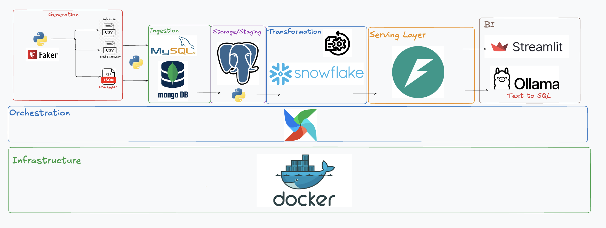
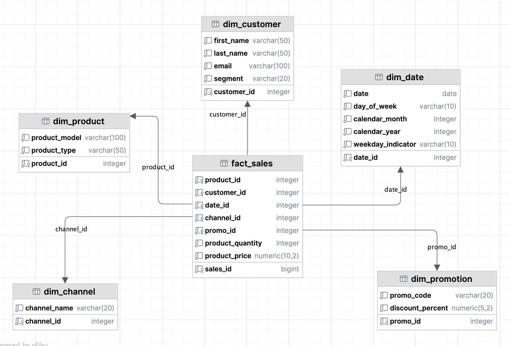
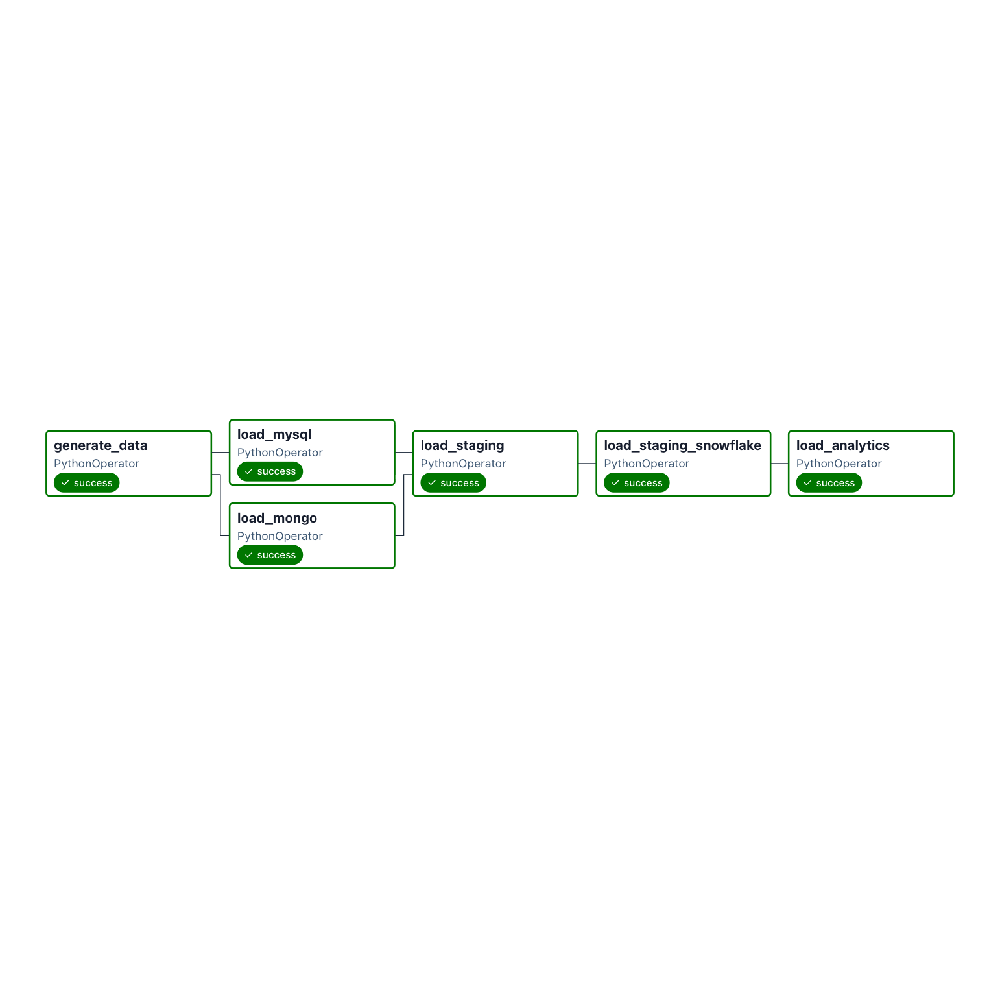

# SoftCart Data Platform

An end-to-end ecommerce data engineering platform simulating real-world data infrastructure — from source system ingestion through dimensional modeling to analytics dashboards. Powered by local LLMs via Ollama for AI-assisted SQL generation.

---

## Architecture


```
Data Generation (Python)
    ├── catalog.json ──→ MongoDB (Product Catalog)
    └── sales.csv ────→ MySQL (Transactional Sales)
    └── customers.csv ─→ MySQL (Customer Data)
                ↓
        ETL (Python + SQLAlchemy)
                ↓
        PostgreSQL (Staging Layer → Analytics Layer)
                ↓
        Dashboards (Streamlit / Tableau)
```

---

## Tech Stack

| Layer | Technology | Purpose |
|-------|-----------|---------|
| OLTP | MySQL 8.0 | Transactional sales and customer data |
| NoSQL | MongoDB 7.0 | Product catalog storage |
| DWH | PostgreSQL 16 | Staging and analytics (star schema) |
| Containerization | Docker Compose | All databases containerized on a shared network |
| ETL | Python, SQLAlchemy, pandas | DB-to-DB transfer with transformations |
| Data Generation | Python, Faker | Referentially consistent ecommerce datasets |
| Scripting | Bash | Bulk data loading via native DB tools |
| Scheduling | CRON | Automated pipeline execution |

---

## Project Structure

```
SoftCart-Data-Platform/
├── databases/                # Singleton connection managers
│   ├── mysqlconn.py          # MySQL connection (mysql.connector + SQLAlchemy)
│   ├── mongoconn.py          # MongoDB connection (pymongo)
│   └── postgresconn.py       # PostgreSQL connection (psycopg2 + SQLAlchemy)
├── datasource/               # Data generation pipeline
│   ├── GenerateProducts.py   # Product config and model name generation
│   ├── GenerateCatalog.py    # Catalog with IDs, types, and prices
│   ├── GenerateCustomers.py  # Customer profiles with segments
│   └── GenerateData.py       # Main orchestrator — generates all datasets
├── DWH/                      # Data warehouse ETL
│   └── postgressstaging.py   # ETL: MySQL/MongoDB → PostgreSQL staging
├── scripts/                  # Bash and SQL scripts
│   ├── mongo.sh              # Bulk load catalog.json into MongoDB
│   ├── mysql.sh              # Bulk load sales.csv into MySQL
│   ├── DDL.sql               # Table definitions
│   └── sales_data.sql        # LOAD DATA INFILE commands
├── data/                     # Generated datasets
│   ├── catalog.json          # 141 products (phones, laptops, tablets, watches)
│   ├── sales.csv             # 100K transactions
│   └── customers.csv         # 1000 customers with segments
├── resources/
│   └── config_file.ini       # Database credentials (not committed)
├── docker-compose.yaml       # MySQL + MongoDB + PostgreSQL
├── airflow/                  # Future: Airflow DAGs
└── streamlit/                # Future: Analytics dashboard
```

---

## Data Model


### Source Systems (OLTP)

**MySQL — `softcart_sales`**
- `sales_data`: product_id, customer_id, price, quantity, time_stamp
- `customers`: customer_id, first_name, last_name, email, segment

**MongoDB — `catalog_db`**
- `catalog`: product_id, product_model, product_type, product_price

### Staging Layer (PostgreSQL — `staging` schema)
- `staging.sales_data` — raw replica of MySQL transactions
- `staging.catalog` — transformed catalog from MongoDB
- `staging.customers` — raw replica of MySQL customers

### Analytics Layer (PostgreSQL — `analytics` schema)
- `analytics.fact_sales` — transactional fact table (quantity, price, FK to all dimensions)
- `analytics.dim_product` — product dimension (model, type)
- `analytics.dim_customer` — customer dimension (name, email, segment)
- `analytics.dim_date` — date dimension (day, month, year, weekday indicator)
- `analytics.dim_channel` — sales channel dimension (Online, In-Store, Mobile App)
- `analytics.dim_promotion` — promotion dimension (promo code, discount percent)

## Airflow DAG 


---

## Business Questions
1. Which product categories and individual products drive the most revenue vs quantity?
2. How are sales trending over time — are certain categories growing or declining?
3. What does customer purchasing behavior look like — repeat buyers vs one-time, spending tiers?
4. What is the revenue concentration — do a small number of products/customers account for most sales?
5. Which products sell best on which channel, and do promotions drive more volume or just discount revenue?

---

## Getting Started

### Prerequisites
- Docker and Docker Compose
- Python 3.12+
- uv (recommended) or pip

### Setup

```bash
# Clone the repo
git clone https://github.com/YOUR_USERNAME/SoftCart-Data-Platform.git
cd SoftCart-Data-Platform

# Start databases
docker compose up -d

# Install dependencies
uv venv && source .venv/bin/activate
uv pip install -r requirements.txt

# Generate data
python -m SoftCartCapstone.datasource.GenerateData

# Load data into OLTP
bash scripts/mongo.sh
bash scripts/mysql.sh

# Run ETL to PostgreSQL
python -m SoftCartCapstone.DWH.postgressstaging
```

### Verify

```bash
# Check MySQL
docker exec -it mysql_db mysql -u softcart_user -p -e "SELECT COUNT(*) FROM softcart_sales.sales_data;"

# Check MongoDB
docker exec -it mongo_db mongosh -u softcart_user -p --authenticationDatabase admin --eval "db.catalog.countDocuments()"

# Check PostgreSQL
docker exec -it postgres_dwh psql -U softcart_user -d softcart_staging -c "SELECT COUNT(*) FROM staging.sales_data;"
```

---

## Configuration

Create `resources/config_file.ini` with the following structure:

```ini
[mysql]
host:localhost
port:3307
user:softcart_user
password:your_password
database:softcart_sales

[mongodb]
host:localhost
port:27018
user:softcart_user
password:your_password
database:catalog_db
auth_source:admin

[postgresql]
host:localhost
port:5433
user:softcart_user
password:your_password
database:softcart_staging
```

---

## Roadmap

- [x] Data generation pipeline (products, transactions, customers)
- [x] Docker Compose (MySQL, MongoDB, PostgreSQL)
- [x] Singleton connection managers
- [x] Bash scripts for bulk loading
- [x] ETL: MySQL/MongoDB → PostgreSQL staging
- [x] Dimensional modeling (star schema in analytics layer)
- [x] Streamlit / Tableau dashboards
- [x] CRON scheduling
- [x] Apache Airflow migration
- [x] Snowflake cloud DWH
- [x] FastAPI serving layer
- [x] Ollama text-to-SQL analytics

---

## License

This project is for educational and portfolio purposes.
